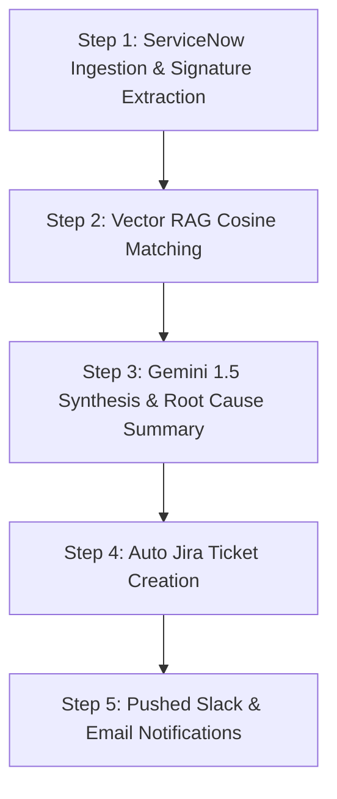

# 🚀 TriagePulseAI — User Operating Manual & Step-by-Step Guide

Welcome to the official **TriagePulseAI** Operating Manual. This document provides a complete step-by-step walkthrough matching your exact project workflow with high-resolution screenshot references.

---

## 📌 Table of Contents
1. [Overview & Executive Dashboard Screenshot](#1-overview--executive-dashboard)
2. [Left Sidebar Navigation & Triggering Resolution](#2-left-sidebar-navigation--resolution-trigger)
3. [Gathered Evidence & Diagnostic Log Analysis](#3-gathered-evidence--diagnostics-with-screenshot)
4. [Listing Matched Historical Incidents (RAG Corpus)](#4-listing-relevant-historical-incidents-rag)
5. [Step-by-Step AI Root Cause & Remediation](#5-step-by-step-ai-root-cause--remediation)
6. [Auto-Generated Jira Ticket Sync](#6-auto-generated-jira-ticket-with-screenshot)
7. [Pushed Notification Cards (Slack & Email Alerts)](#7-pushed-notification-cards-slack--email)

---

## 1. Overview & Executive Dashboard

*Figure 1: Full TriagePulseAI Dashboard showing live telemetry metrics, topology nodes, and streaming status.*

---

## 2. Left Sidebar Navigation & Resolution Trigger

To start an incident investigation or test production scenarios:

1. Locate the **Left Navigation Sidebar** on the dashboard.
2. Select **"Overview / Resolution Center"** or click the **"Simulate ServiceNow Email"** button.
3. Select your target production scenario (e.g., *Stripe Client ID null*, *RabbitMQ Disk Full*, *State Mismatch*, or *NullPointerException*).
4. Click **"Run AI Triage Pipeline"** on the right panel to initiate real-time SSE streaming.

---

## 3. Gathered Evidence & Diagnostics (with Screenshot)

Once an alert is ingested, the system automatically aggregates logs, telemetry, and error stacktraces into the **Gathered Evidence Card**.

*Figure 3: Gathered Evidence & Diagnostic Log Snippets displaying exact stack traces (e.g. `java.lang.NullPointerException` or `Jackson ObjectMapper NoSuchMethodError`).*

---

## 4. Listing Relevant Historical Incidents (RAG)

TriagePulseAI queries its **FAISS Vector Store** to find historical incidents matching the current stack trace and signature:

| Incident ID | Severity | Matched Root Cause | Similarity Score | Resolution |
| :--- | :--- | :--- | :--- | :--- |
| **INC-2026-0391** | HIGH | `jackson-databind` dependency mismatch in Prod | **94%** | Upgrade pom.xml dependency to v2.15.2 |
| **INC-2026-0182** | CRITICAL | Kafka consumer group poll timeout | **91%** | Increase `max.poll.interval.ms` to 600,000ms |
| **INC-2026-0094** | CRITICAL | Vault TLS certificate token expired | **97%** | Renew Vault service account token |

---

## 5. Step-by-Step AI Root Cause & Remediation

The pipeline streams step-by-step diagnostic milestones in real-time:

---

## 6. Auto-Generated Jira Ticket (with Screenshot)

*Figure 6: Auto-created Jira Ticket Card (`TPAI-492`) persisted in database with direct Atlassian URL link and confidence breakdown.*

---

## 7. Pushed Notification Cards (Slack & Email)

After resolution analysis completes, TriagePulseAI automatically pushes alerts:
- **Slack Notification Card**: Posted to `#incident-response` channel with incident summary, transaction ID, severity badge, and recommended action steps.
- **SMTP Email Alert Card**: Dispatches structured HTML email containing diagnostic findings to on-call engineering leads.
